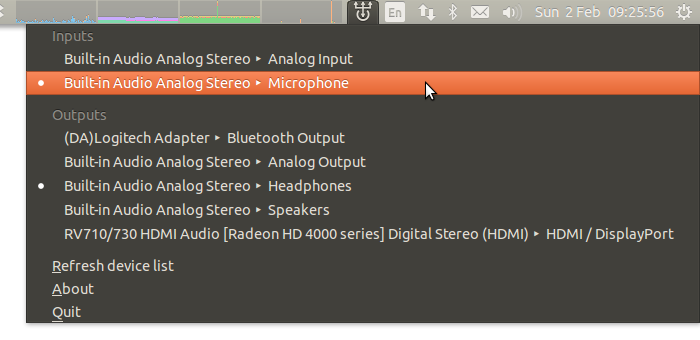

Sound Switcher Indicator
========================

Sound input/output selector indicator for Ubuntu/Unity. I created this app because there was just no sound switcher indicator available.

It shows an icon in the indicator area in Ubuntu's Panel. Icon's menu allows you to switch the current sound input and output (i.e. *source* and *sink* in PulseAudio's terms, respectively) with just two clicks:

The application makes use of native PulseAudio interface. The list of devices is updated automatically thanks to PulseAudio subscription capabilities.

Installation
------------

Please refer to the [INSTALL](INSTALL) document.

For details see http://yktoo.com/software/indicatorSoundSwitcher
