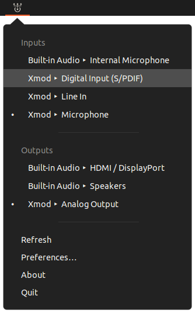

# Sound Switcher Indicator

Sound input/output selector application for Linux.

It shows an icon in the indicator area or the system tray (whatever is available in your desktop environment). The icon's menu allows you to switch the current sound input and output (i.e. *source ports* and *sink ports* in PulseAudio's terms, respectively) with just two clicks:

The application makes use of the native PulseAudio API.

For details see:
* http://yktoo.com/en/software/indicator-sound-switcher/ (English)
* http://yktoo.com/ru/software/indicator-sound-switcher/ (русский)

More in the documentation:
* [Installation](doc/install.md)
* [Configuration](doc/config.md)
* [Localisation](doc/i18n.md)
* [Changelog](debian/changelog)

## Bug Reporting

Run the application in verbose mode to see the detailed log:

    indicator-sound-switcher -vv

and, once the error condition has been reproduced, [file a bug report](https://github.com/yktoo/indicator-sound-switcher/issues) and attach the output to it.
